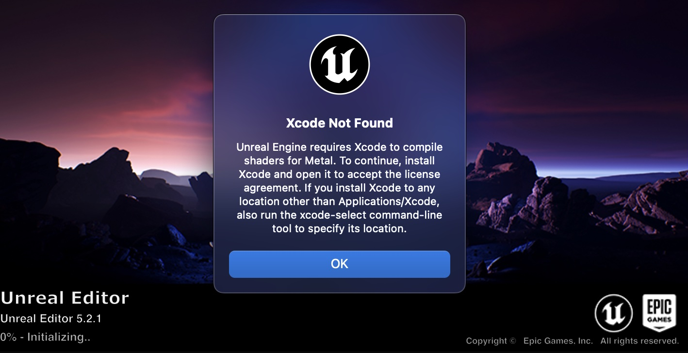

# unreal5
This is course about unreal 5


https://www.udemy.com/course/unrealcourse/learn/lecture/31718228#overview


# 0. setup
1. install Xcode
```bash
# setup the xcode path for unreal5 engine
$ sudo xcode-select -s /Applications/Xcode.app
```



2. default layout
```bash
$ window -> load layout -> default layout
```

3. moving & placing actors
    - everything inside unreal-5 is an actor

4. C++ versus Blueprint
    1. what is blueprint?
        - 
    2. blueprint strengths
        1. quick to change
        2. beginner friendly
        3. easy to discover
        4. tailor-made
        5. designer/ artist friendly
    3. C++ strengths
        1. more concise
        2. industry standard
        3. high speed
        4. access all areas
        5. good for bigger projects
    4. blueprint & C++
        - 
    5. blueprint contents (Section 2, Section 3 for C++)
        - Progamming basics with blueprint
            - variables, if-statement, functions
        - Basic maths and concepts
            - vectors, transform, rotations
        - unreal core concepts
            - actors, component pawn, maps
        - Assets
            - marketplace, importing, BSP modeling, materials


5. Helping us to help you
    - Good Questions?
        1. what have you tried?
        2. what did you expect to happend?
        3. what actually happened?
        4. be specific: exact errors, screenshots, etc
    - Useful information to include
        1. steps you've taken
        2. screenshots
        3. full build logs(c++)
        4. editor log
        5. your projects
    - find your logs
        1. from unreal-engine
            - 
        2. `or` console.app -> log reports -> IntroProject.log
            - 
        
        3. create your gist 
            -  https://gist.github.com/

    - share your project
        - zip your project
            - 